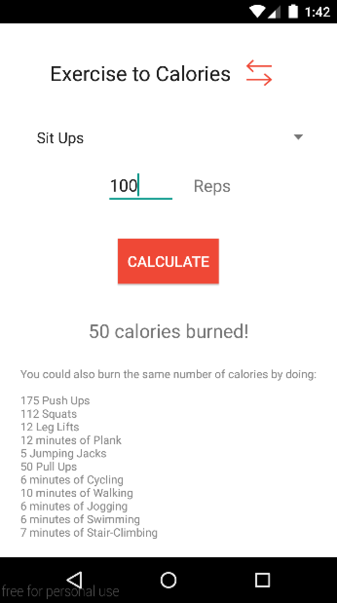

# PROG 01: Crunch Time

Crunch Time lets you keep track of how many calories you’re burning or find new ways to burn them with a variety of exercises!

## Authors

Dipsikha Halder ([dhalder@berkeley.edu](mailto:dhalder@berkeley.edu))

## Demo Video

See [The Crunch Time Video Walkthrough] (https://youtu.be/PvVUCpGrVak)

## Screenshots

Splash Screen

Exercise to Calorie Home Screen

Dropdown with options to choose from

Calorie to Exercise Converter

